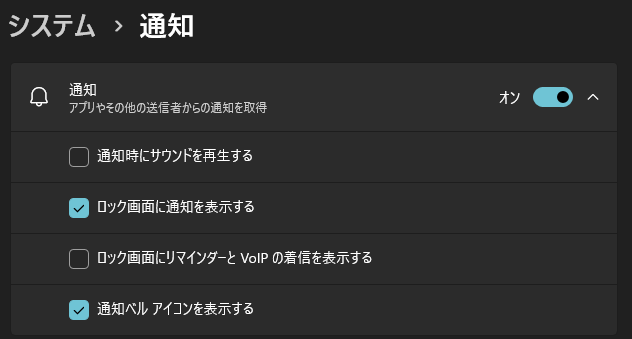

# README

This Windows PowerShell script automatically checks each Git repository within a specified root directory and notifies you with a Windows toast notification if there are updates on the remote repository.

## Install / Uninstall

Root directory to check can be specified with a commandline argument of [install.ps1](./install.ps1). Default is `$env:USERPROFILE | Join-Path -ChildPath "Personal\tools\repo"`.

- [check-remote.ps1](./check-remote.ps1) will be copied to `$env:AppData\Roaming\git-status-toast`.
- Scheduled task to run `check-remote.ps1` on logon and 13:00 will be registered.

[uninstall.ps1](./uninstall.ps1) removes all data from PC.

## Notes

- Git Installation: Git must be installed on the system running the script, and the git command should be accessible from the command prompt or PowerShell.
- PowerShell Version: The toast notification function (`Invoke-Toast`) in this script might not work on PowerShell 6.0+ due to changes in how Universal Windows Platform (UWP) APIs are called. It should work without issues on PowerShell 5.1 (which is typically pre-installed on Windows).

### Tips

